# FitMon GO

**Catch reps, not monsters.** FitMon GO is a location-based fitness game for a TSA app pitch. It works like Pokémon GO, but you collect exercises instead of creatures.

- **Explore:** a Pokémon GO / Google Maps-style map puts you near the bottom of the screen, and the world turns as you turn. Exercises spawn nearby. The harder the move, the rarer the spawn: Common, Uncommon, Rare, Epic, Legendary and Mythic, from push-ups up to front levers and planches.
- **Street Mode:** on roads and in public places, only safe run and walk missions spawn. They level up Speed and Endurance.
- **Gym Mode:** when you're at a gym or in a gym session, you pick a target muscle and clear a raid of missions to level up that muscle.
- **Arena:** you battle other players online. Your moves come from your real stats, and you can use power-ups. Legendary skills like the muscle-up unlock finishers.
- **Street duels:** when two trainers get within 50 m of each other, they can duel. A duel is best of 3 sets, and each player gets a buff from their own FitMon in every set. Whoever wins 2 sets steals one random FitMon from the other player. Common ones get picked most often (40%). Mythics almost never do (2%). Your 3 favorite FitMon are always safe, and you have to wait 24 hours for a rematch.

- **FitDex and battle deck:** the FitDex lists every FitMon you own, rarest first, and you can swipe sideways through each tier. Tapping one shows the buff it gives you and the move it unlocks. On the battle deck screen you choose which 4 moves to take into fights, alongside your finisher and a power-up.

## Pitch visuals

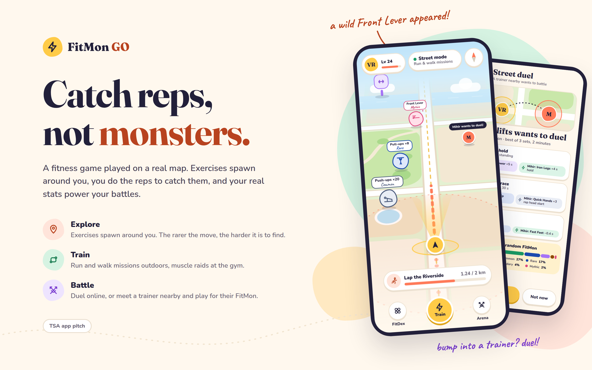

| | | |
|---|---|---|
| 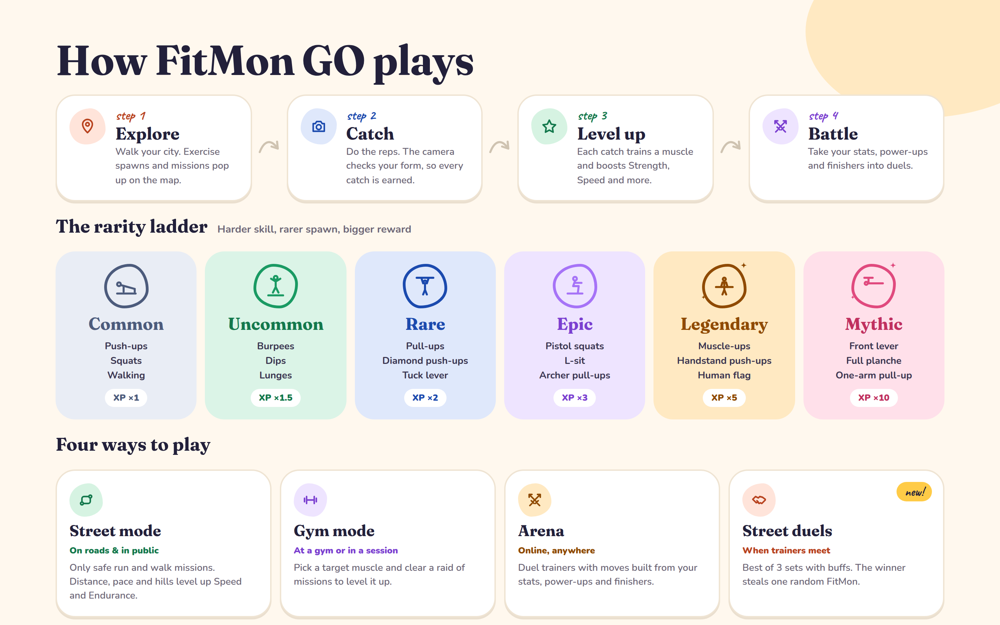 | 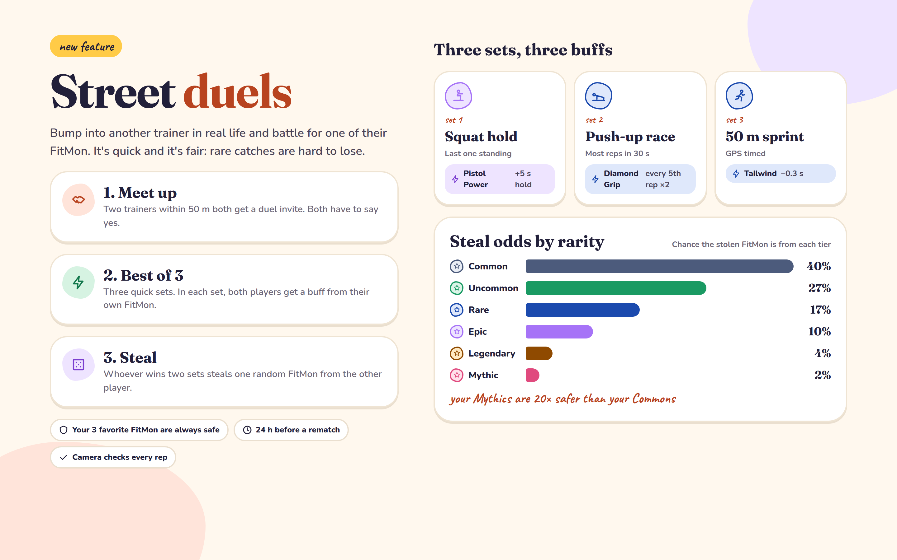 | |

| Explore map | Mythic encounter | Street mode | Gym mode |
|---|---|---|---|
| 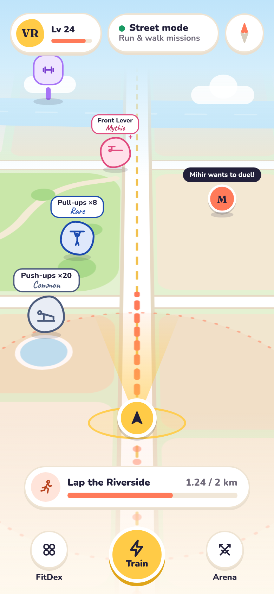 | 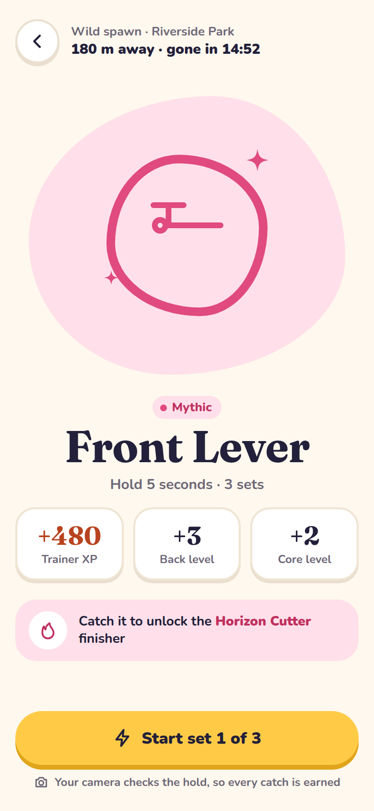 | 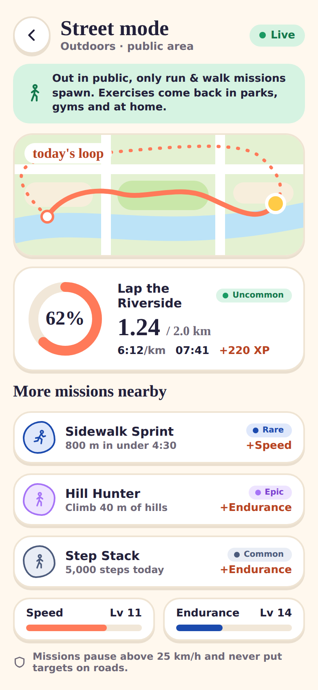 | 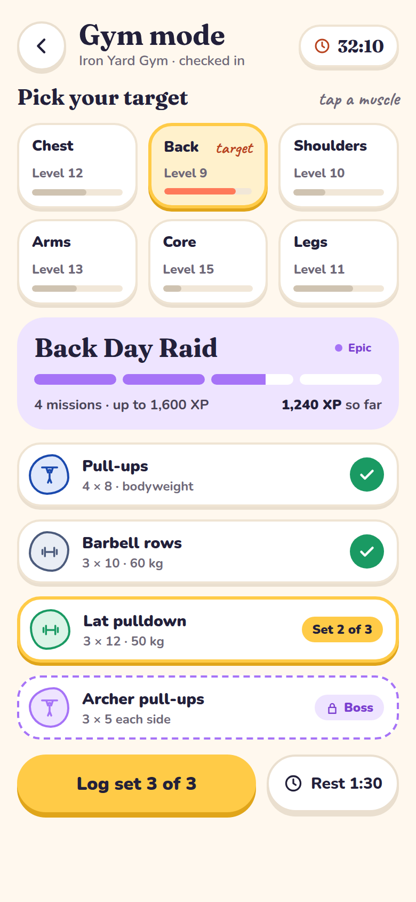 |

| FitDex | Trainer stats | Online arena | Finisher unlocked |
|---|---|---|---|
| 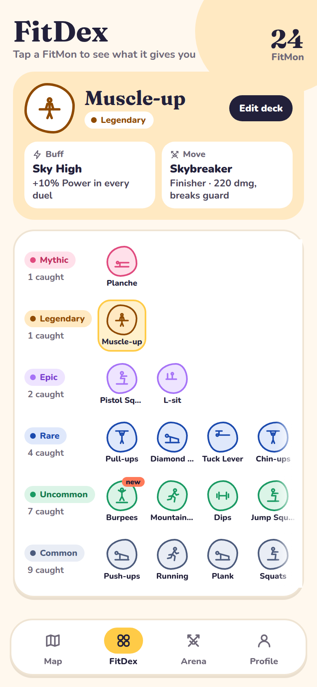 | 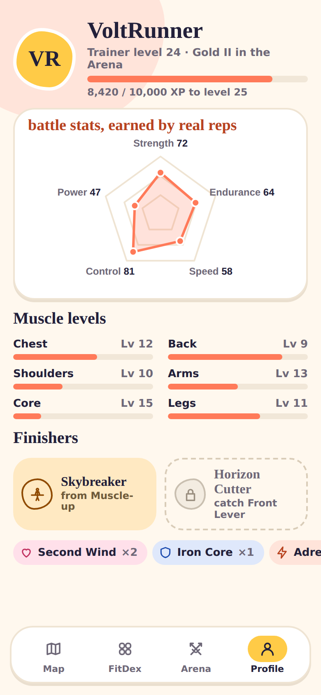 | 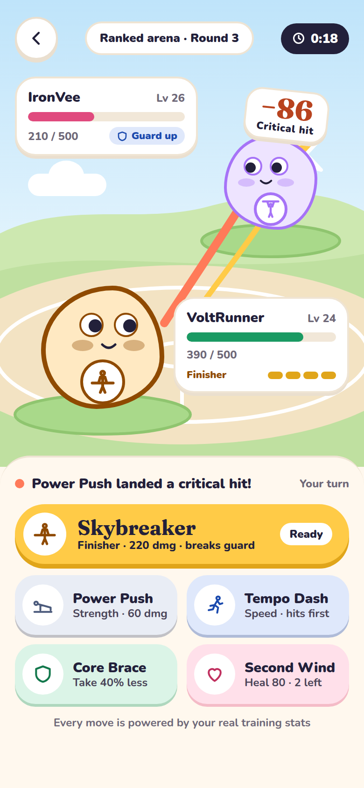 | 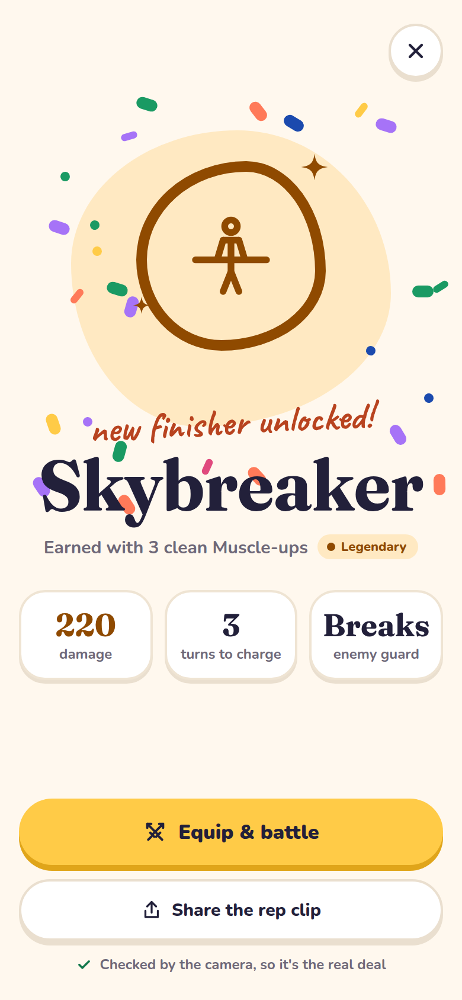 |

| Duel invite | Duel, set 2 | Duel result | Battle deck |
|---|---|---|---|
| 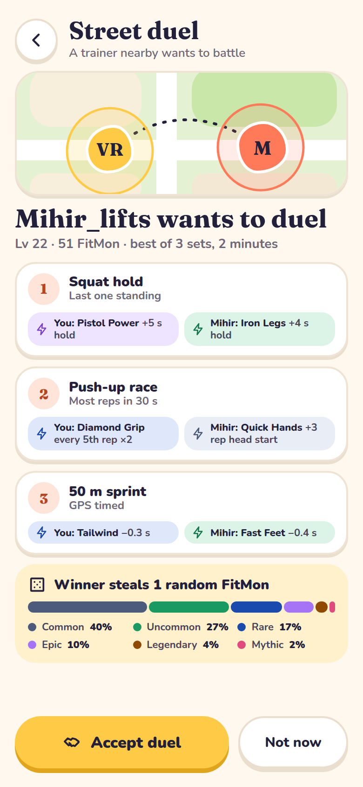 | 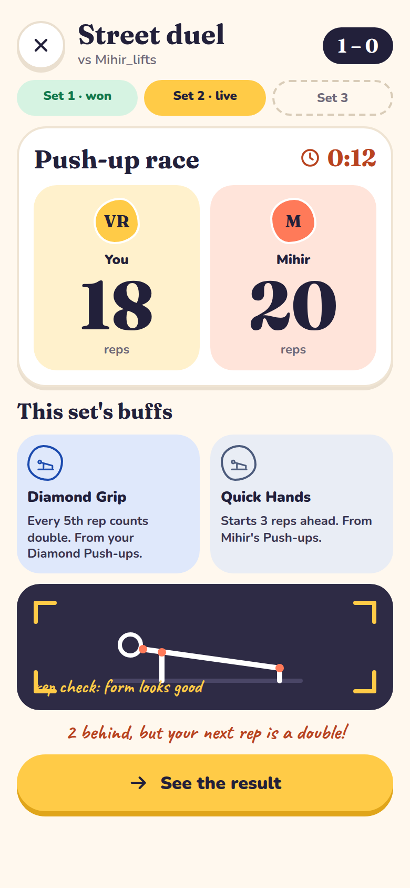 | 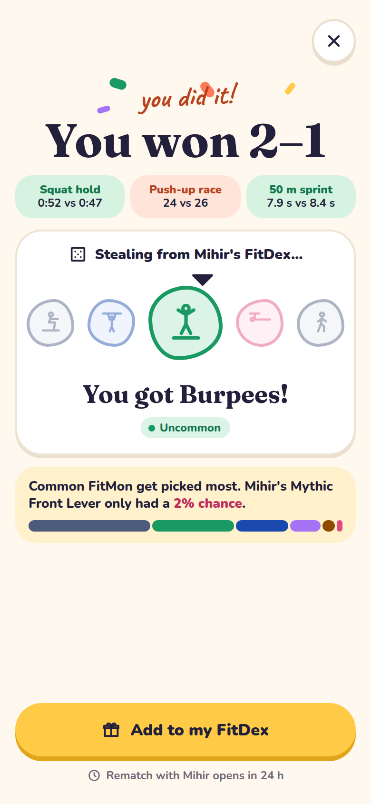 | 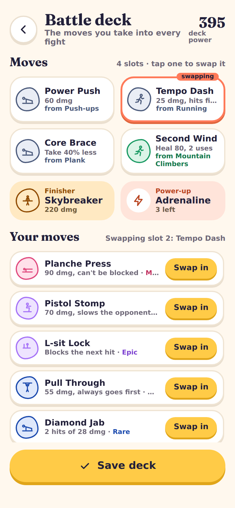 |

### Files

- `design/screens/`: the screens as Design-canvas artboards (`.dc.html`) plus `canvas.json`.
- `design/generate_screens.py`: rebuilds everything in `design/screens/`.
- `design/screenshots/`: a PNG of each screen at 2× resolution.
- `design/render_screenshots.js`: recreates the PNGs. It needs Node with `playwright` installed and uses the Chromium at `/opt/pw-browsers`.
